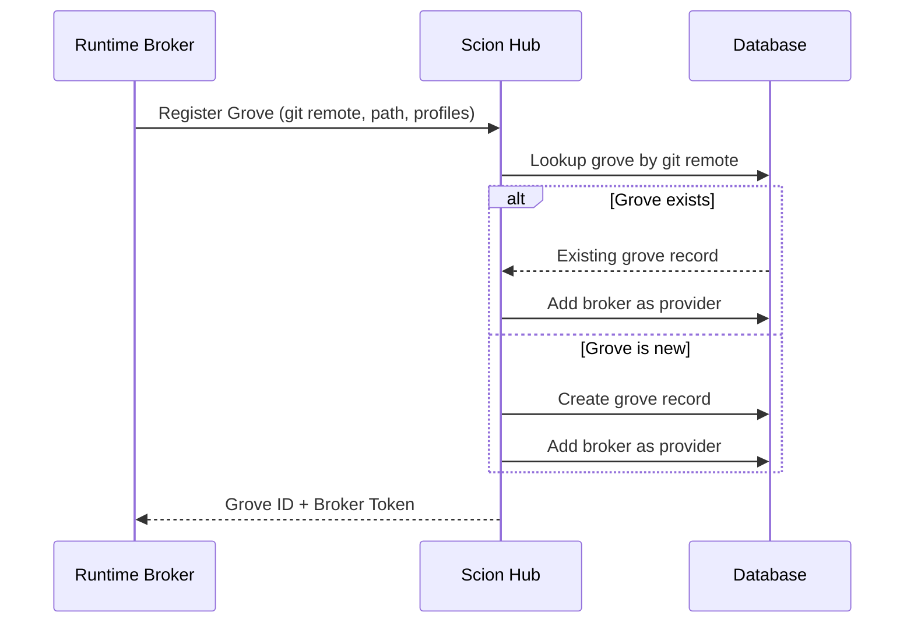
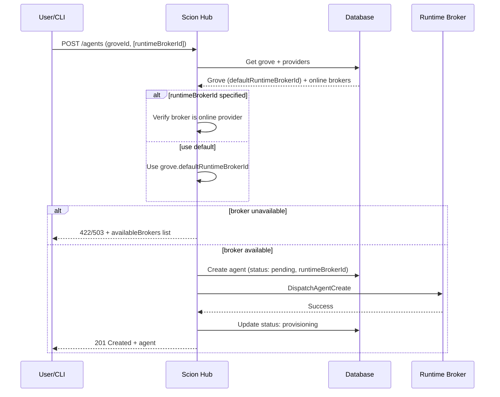
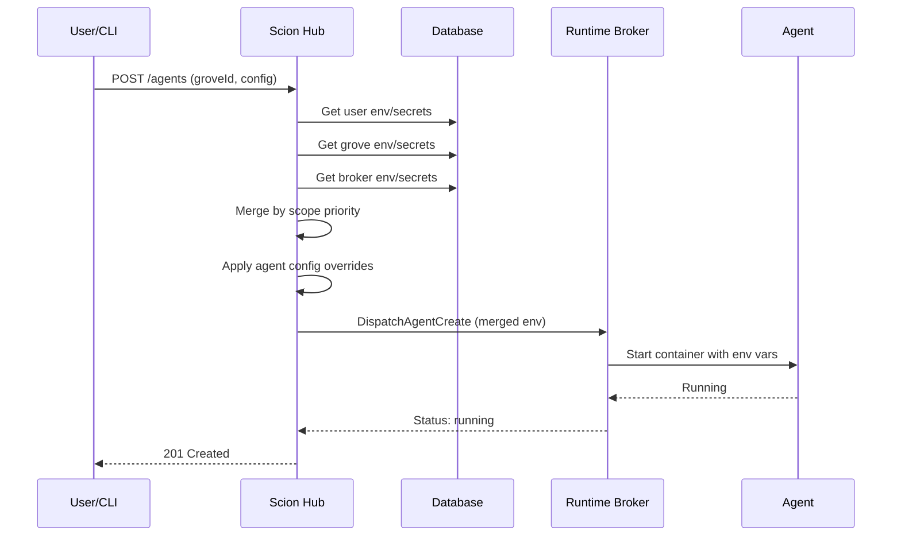

# Hosted Scion Architecture Design

## Status
**Proposed**

## 1. Overview
This document outlines the architecture for transforming Scion into a distributed platform supporting multiple runtime environments. The core goal is to separate the **State Management** (persistence/metadata) from the **Runtime Execution** (container orchestration).

The architecture introduces:
*   **Scion Hub (State Server):** A centralized API and database for agent state, groves, templates, and users.
*   **Groves (Projects):** The primary unit of registration with the Hub. A grove represents a project/repository and is the boundary through which runtime brokers interact with the Hub.
*   **Runtime Brokers:** Compute nodes with access to one or more container runtimes (local Docker, Kubernetes cluster, etc.). Brokers expose functionality *through* their registered groves, not as standalone entities.

This distributed model supports fully hosted SaaS scenarios, hybrid local/cloud setups, and "Solo Mode" (standalone CLI) using the same architectural primitives.

### Key Architectural Principle: Grove-Centric Registration

The **Grove** is the fundamental unit of Hub registration, not the Runtime Broker. When a local development environment or server connects to a Hub, it registers one or more groves. This design reflects the reality that:

1. **Groves have identity** - A grove is uniquely identified by its git remote URL (when git-backed). This provides a natural deduplication mechanism.
2. **Brokers are ephemeral** - Developer laptops come and go; what matters is the project they're working on.
3. **Groves can span brokers** - Multiple developers (runtime brokers) can contribute agents to the same grove.
4. **Profiles are per-grove** - Runtime configuration (Docker vs K8s, resource limits) is defined in grove settings.

### Key Architectural Principle: Explicit Mode Selection (No Silent Fallback)

The operating mode (Solo vs Hub-connected) must always be **explicit and unambiguous**. When Hub integration is enabled, any Hub connectivity or configuration issue results in an **error**, not a silent fallback to local mode.

**Rationale:**
1. **Clarity of operation** - Users must always know whether operations are being performed locally or via the Hub. Ambiguity leads to confusion when debugging issues.
2. **Predictable behavior** - If Hub mode is enabled but the Hub is unreachable, failing loudly ensures users are aware of the problem rather than unknowingly operating in a degraded state.
3. **Data consistency** - Silent fallback could lead to split-brain scenarios where some operations go to the Hub and others remain local.
4. **Debugging clarity** - When bugs occur, it must be immediately clear which mode was active. Silent fallback obscures this.

**Implementation:**
*   `scion hub enable` explicitly enables Hub mode
*   `scion hub disable` explicitly returns to Solo mode
*   `--no-hub` flag provides per-invocation override to force local mode
*   When Hub is enabled but unavailable/misconfigured, CLI commands return an error with guidance to either fix the Hub connection or run `scion hub disable`

### Connectivity and Permissions

Operational capabilities are determined by the **permissions system**. A Runtime Broker is either **Online** (connected to the Hub) or **Offline**.

When a broker is Online, the operations it can perform or receive are governed by policies:
*   **Agent Lifecycle**: Permissions like `agent:create`, `agent:stop`, and `agent:delete` determine if the Hub can command the broker to modify agents.
*   **Visibility**: Permissions like `agent:read` determine if the broker's agents are visible in the Hub dashboard and CLI.
*   **Reporting**: Runtime brokers automatically report status and heartbeats to the Hub when connected, providing real-time visibility based on the user's access level.

#### Solo Mode
Standalone operation where the `scion` CLI acts as its own manager using local file state and labels. No Hub connectivity is required or used.

## 2. Goals & Scope
*   **Grove-Centric Registration:** Groves are the unit of registration with the Hub. Runtime brokers register the groves they serve.
*   **Git Remote as Identity:** Groves associated with git repositories are uniquely identified by their git remote URL. This ensures a single Hub grove maps to exactly one repository.
*   **Distributed Groves:** A single grove can span multiple runtime brokers (e.g., multiple developers working on the same project).
*   **Centralized State:** Agent metadata is persisted in a central database (Scion Hub), enabling cross-broker visibility.
*   **Flexible Runtime:** Agents can run on local Docker, a remote server, or a Kubernetes cluster. Runtime configuration is defined per-grove in profiles.
*   **Unified Interface:** Users interact with the Scion Hub API (or a CLI connected to it) to manage agents across any broker.
*   **Web-Based Access:** Support for web-based PTY and management for hosted agents.

## 3. High-Level Architecture

```mermaid
graph TD
    User[User (CLI)] -->|HTTPS/WS| Hub[Scion Hub (State Server)]
    Browser[User (Browser)] -->|HTTPS/WS| Web[Web Frontend]
    Web -->|Internal API| Hub

    Hub -->|DB| DB[(Firestore/Postgres)]

    subgraph Grove: my-project (git@github.com:org/repo.git)
        HostA[Runtime Broker A (K8s)] -->|Agents| PodA[Agent Pod]
        HostB[Runtime Broker B (Docker)] -->|Agents| ContainerB[Agent Container]
    end

    Hub <-->|Grove Registration| HostA
    Hub <-->|Grove Registration| HostB

    Web -.->|PTY Proxy| Hub
    User -.->|Direct PTY (Optional)| HostA
```

### Server Components

The distributed Scion platform consists of three server components, all implemented in the same binary:

| Component | Port | Purpose |
|-----------|------|---------|
| **Runtime Broker API** | 9800 | Agent lifecycle on compute nodes |
| **Hub API** | 9810 | Centralized state, routing, coordination |
| **Web Frontend** | 9820 | Browser dashboard, OAuth, PTY relay |

See `server-implementation-design.md` for detailed server configuration.

### Registration Flow



## 4. Core Components

### 4.1. Scion Hub (State Server)
The central authority responsible for:
*   **Persistence:** Stores `Agents`, `Groves`, `Users`, and `Templates`.
*   **Grove Registry:** Maintains the canonical registry of groves, enforcing git remote uniqueness.
*   **Broker Tracking:** Tracks which runtime brokers contribute to each grove.
*   **Routing:** Directs agent operations to the appropriate runtime broker(s) within a grove.
*   **API:** Exposes the primary REST interface for clients.

### 4.2. Grove (Project) — The Registration Unit
The grove is the **primary unit of registration** with the Hub. A grove represents a project, typically backed by a git repository.

*   **Identity:** Groves with git repositories are uniquely identified by their normalized git remote URL. This is enforced at the Hub level.
*   **Distributed:** A grove can span multiple runtime brokers. Each broker that registers the same grove (identified by git remote) becomes a provider.
*   **Default Runtime Broker:** Each grove has a default runtime broker (`defaultRuntimeBrokerId`) that is used when creating agents without an explicit broker. This is automatically set to the first runtime broker that registers with the grove.
*   **Profiles:** Runtime configuration (Docker vs K8s, resource limits, etc.) is defined per-grove in the settings file. Brokers advertise which profiles they can execute.
*   **Hub Record:** The Hub maintains:
    *   Grove metadata (name, slug, git remote, owner)
    *   Default runtime broker ID for agent creation
    *   List of contributing brokers
    *   Aggregate agent count and status

### 4.3. Runtime Broker
A compute node with access to one or more container runtimes. Brokers do not register themselves as standalone entities; instead, they register the groves they serve.

*   **Grove Registration:** On startup (or on-demand), a broker registers one or more local groves with the Hub.
*   **Authentication:** Brokers authenticate with the Hub using HMAC-based request signing, enabling bidirectional trust without token transmission after initial registration. See [Runtime Broker Auth](auth/runtime-broker-auth.md) for details.
*   **Runtime Providers:** Access to one or more runtimes:
    *   **Docker/Container:** Local container orchestration
    *   **Kubernetes:** Cluster-based pod orchestration
    *   **Apple:** macOS virtualization framework
*   **Profile Execution:** Brokers advertise which grove profiles they can execute based on available runtimes.
*   **Agent Communication:** Configures the `sciontool` inside agents to report status back to the Hub.

### 4.4. Scion Tool (Agent-Side)
The agent-side helper script.
*   **Dual Reporting:** Reports status to the local runtime broker *and* (if configured) the central Scion Hub.
*   **Identity:** Injected with `SCION_AGENT_ID`, `SCION_GROVE_ID`, and `SCION_HUB_ENDPOINT`.

### 4.5. Web Frontend
The browser-based dashboard for user interaction. Detailed specifications are in `server-implementation-design.md`.

*   **Static Assets:** Serves the compiled SPA (embedded in binary or from filesystem).
*   **Authentication:** Handles OAuth login flows (Google, GitHub, OIDC) and session management.
*   **Hub Proxy:** Optionally proxies API requests to the Hub API, simplifying CORS and auth.
*   **PTY Relay:** Proxies WebSocket PTY connections from browsers to the Hub/Runtime Brokers.
*   **Deployment:** Typically deployed alongside the Hub API; can be deployed separately if needed.

## 5. Detailed Workflows

### 5.1. Grove Registration
1.  **Runtime Broker** starts up or user runs `scion hub link`.
2.  **Runtime Broker** reads local grove configuration (path, git remote, profiles).
3.  **Runtime Broker** calls Hub API: `POST /groves/register` with:
    *   Git remote URL (normalized)
    *   Grove name/slug
    *   Available profiles and runtimes
    *   Broker identifier and capabilities
4.  **Scion Hub**:
    *   Looks up existing grove by git remote URL.
    *   If found: adds this broker as a provider to the existing grove.
    *   If not found: creates a new grove record with this broker as the initial provider.
    *   If the grove has no `defaultRuntimeBrokerId`, sets this broker as the default.
    *   Returns grove ID and broker authentication token.
5.  **Runtime Broker** stores the grove ID and token for subsequent operations.

### 5.2. Agent Creation (Hosted/Distributed)
1.  **User** requests agent creation via Scion Hub API, specifying grove and optionally a `runtimeBrokerId`.
2.  **Scion Hub** resolves the runtime broker:
    *   If `runtimeBrokerId` is explicitly provided, verify it's a valid, online provider to the grove.
    *   Otherwise, use the grove's `defaultRuntimeBrokerId` (set when the first broker registers).
    *   If the resolved broker is unavailable or no broker is configured, return an error with a list of available alternatives.
3.  **Scion Hub**:
    *   Creates `Agent` record with the resolved `runtimeBrokerId` (Status: `PENDING`).
    *   Sends `CreateAgent` command to the Runtime Broker.
    *   Updates status to `PROVISIONING` on successful dispatch.
4.  **Runtime Broker**:
    *   Allocates resources (PVC, Container) according to the selected profile.
    *   Starts the Agent.
    *   Injects Hub connection details.
5.  **Agent**:
    *   Starts up.
    *   `sciontool` reports `RUNNING` status to Scion Hub.



### 5.3. Web PTY Attachment
1.  **User** connects to Scion Hub WebSocket for a specific agent.
2.  **Scion Hub** identifies which Runtime Broker is running the agent.
3.  **Scion Hub** proxies the connection to the Runtime Broker via the control channel.
4.  **Runtime Broker** streams the PTY from the container.

### 5.4. Standalone Mode (Solo)
*   The Scion CLI acts as both the **Hub** (using local file DB) and the **Runtime Broker** (using Docker).
*   No Hub registration or external network dependencies required.
*   Can be upgraded to Hub-connected mode by configuring a Hub endpoint.

## 6. Environment Variables & Secrets Management

The hosted architecture includes a centralized system for managing environment variables and secrets that can be scoped to users, groves, or runtime brokers. These values are securely stored by the Hub and injected into agents at runtime.

### 6.1. Scope Hierarchy

Environment variables and secrets are resolved using a hierarchical scope system. When an agent starts, values are merged in the following order (later scopes override earlier):

```
┌─────────────────────────────────────────────────────────────────┐
│                      Resolution Order                            │
├─────────────────────────────────────────────────────────────────┤
│                                                                  │
│   1. User Scope (lowest priority)                               │
│      └── Variables/secrets defined for the current user         │
│                                                                  │
│   2. Grove Scope                                                 │
│      └── Variables/secrets defined for the grove                │
│                                                                  │
│   3. Runtime Broker Scope                                         │
│      └── Variables/secrets defined for the specific broker      │
│                                                                  │
│   4. Agent Config (highest priority)                            │
│      └── Variables explicitly set in agent creation request     │
│                                                                  │
└─────────────────────────────────────────────────────────────────┘
```

**Example Resolution:**
```
User scope:      API_KEY=user-key, LOG_LEVEL=info
Grove scope:     API_KEY=grove-key, PROJECT_ID=my-project
Broker scope:    LOG_LEVEL=debug
Agent config:    PROJECT_ID=override

Result:          API_KEY=grove-key, LOG_LEVEL=debug, PROJECT_ID=override
```

### 6.2. Data Model

#### EnvVar (Environment Variable)

```json
{
  "id": "string",              // UUID
  "key": "string",             // Variable name (e.g., "API_KEY")
  "value": "string",           // Variable value

  "scope": "string",           // user, grove, runtime_broker
  "scopeId": "string",         // ID of the scoped entity (userId, groveId, brokerId)

  "description": "string",     // Optional description
  "sensitive": false,          // If true, value is masked in UI/logs

  "created": "2025-01-24T10:00:00Z",
  "updated": "2025-01-24T10:30:00Z",
  "createdBy": "string"        // User ID who created this
}
```

#### Secret

Secrets are write-only values that cannot be retrieved after creation. They follow the same scoping rules as environment variables but have additional security constraints.

```json
{
  "id": "string",              // UUID
  "key": "string",             // Secret name (e.g., "ANTHROPIC_API_KEY")

  "scope": "string",           // user, grove, runtime_broker
  "scopeId": "string",         // ID of the scoped entity

  "description": "string",     // Optional description
  "version": 1,                // Incremented on each update

  "created": "2025-01-24T10:00:00Z",
  "updated": "2025-01-24T10:30:00Z",
  "createdBy": "string",
  "updatedBy": "string"
}
```

**Note:** The `value` field is intentionally omitted from Secret responses. Secrets are never returned via the API after creation.

### 6.3. Storage

#### Initial Implementation (Clear-Text)

The initial implementation stores values directly in the database:
*   **Environment Variables:** Stored in clear-text in the `env_vars` table
*   **Secrets:** Stored in clear-text in the `secrets` table (future: encrypted)

#### Future Improvements

1. **At-Rest Encryption:** Secrets encrypted using AES-256-GCM with a key derived from a master secret
2. **Key Management Service:** Integration with cloud KMS (GCP KMS, AWS KMS)
3. **External Secret Backends:**
   *   HashiCorp Vault
   *   GCP Secret Manager
   *   AWS Secrets Manager

### 6.4. CLI Interface

The CLI provides commands for managing environment variables and secrets at different scopes.

#### Environment Variables

```bash
# User scope (current authenticated user)
scion hub env set FOO bar                    # Set user-scoped variable
scion hub env get FOO                        # Get specific variable
scion hub env get                            # List all user variables
scion hub env clear FOO                      # Delete variable

# Grove scope
scion hub env set --grove <grove-id> FOO bar # Explicit grove ID
scion hub env set --grove FOO bar            # Infer grove from current directory
scion hub env get --grove <grove-id> FOO     # Get grove variable
scion hub env get --grove                    # List grove variables
scion hub env clear --grove FOO              # Delete grove variable

# Runtime Broker scope
scion hub env set --broker <broker-id> FOO bar  # Explicit broker ID
scion hub env set --broker FOO bar              # Use current machine as broker
scion hub env get --broker <broker-id> FOO      # Get broker variable
scion hub env get --broker                      # List broker variables
scion hub env clear --broker FOO                # Delete broker variable
```

#### Secrets

Secrets follow the same pattern but use the `secret` subcommand. Note that `get` only returns metadata, never the secret value.

```bash
# User scope
scion hub secret set API_KEY <value>         # Set user-scoped secret
scion hub secret get API_KEY                 # Get metadata (no value)
scion hub secret get                         # List all user secrets
scion hub secret clear API_KEY               # Delete secret

# Grove scope
scion hub secret set --grove API_KEY <value> # Set grove-scoped secret
scion hub secret get --grove                 # List grove secrets
scion hub secret clear --grove API_KEY       # Delete grove secret

# Runtime Broker scope
scion hub secret set --broker API_KEY <value>  # Set broker-scoped secret
scion hub secret get --broker                  # List broker secrets
scion hub secret clear --broker API_KEY        # Delete broker secret
```

#### Grove and Broker Inference

When `--grove` or `--broker` is specified without an ID:
*   **Grove:** Inferred from the current git repository's remote URL, or from `.scion/settings.yaml` if a grove ID is stored locally
*   **Broker:** Inferred from the current machine's hostname or stored broker ID in local settings

### 6.5. Agent Injection Flow

When an agent is created, the Hub resolves and injects environment variables and secrets:



The merged environment is passed to the Runtime Broker as part of the `CreateAgent` command. The Runtime Broker then injects these values into the agent container.

### 6.6. Security Considerations

1. **Secrets are write-only:** The API never returns secret values after creation
2. **Audit logging:** All secret access and modifications are logged with user attribution
3. **Scope isolation:** Users can only manage secrets for resources they own or have write access to
4. **Transport security:** All API communication uses TLS
5. **Secret masking:** Secret values are masked in logs, UI, and error messages
6. **Rotation support:** Secrets can be updated in place; version tracking enables rollback

### 6.7. Access Control

| Operation | User Scope | Grove Scope | Broker Scope |
|-----------|------------|-------------|--------------|
| Create/Update | Owner only | Grove owner/admin | Broker owner/admin |
| Read (env) | Owner only | Grove members | Broker providers |
| Read (secret metadata) | Owner only | Grove members | Broker providers |
| Read (secret value) | Never via API | Never via API | Never via API |
| Delete | Owner only | Grove owner/admin | Broker owner/admin |

## 7. Migration & Compatibility
*   **Manager Interface:** The `pkg/agent.Manager` will be split/refined to support remote execution.
*   **Storage Interface:** Introduce `pkg/store` interface to abstract `sqlite` (local) vs `firestore` (hosted).