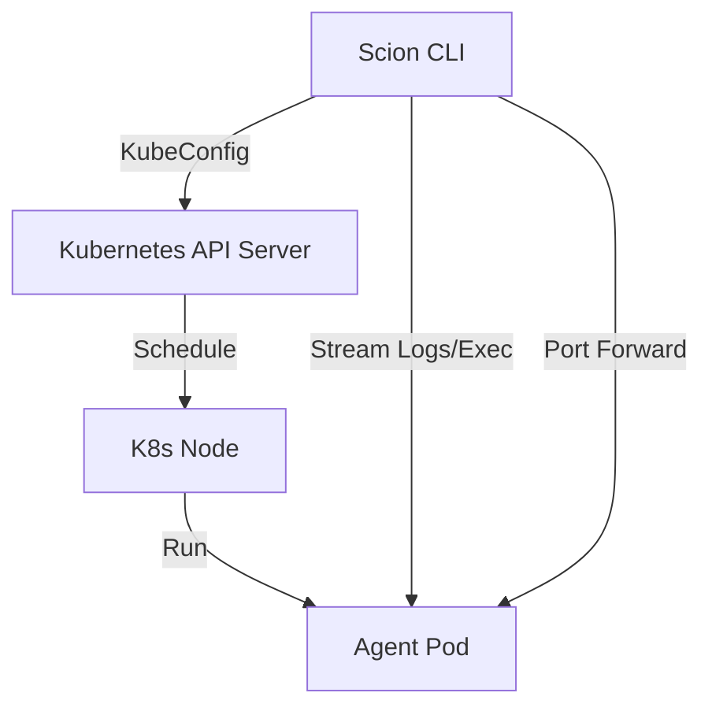

# Kubernetes Runtime Design

## Overview
This document outlines the design for adding a Kubernetes (K8s) runtime to the `scion-agent` CLI. This will allow agents to execute as Pods in a remote or local Kubernetes cluster, enabling scalability, resource management, and isolation superior to local Docker execution.

## Goals
- Allow `scion run` to execute agents in a Kubernetes cluster.
- Maintain a developer experience (DX) as close as possible to the local `docker` runtime.
- Support "Agent Sandbox" technologies for secure execution.
- Solve the challenges of remote file system access and user identity.
- Support a single 'grove' as being a mixture of local and remote agents


## Architecture

The `scion` CLI will act as a Kubernetes client, interacting directly with the Kubernetes API (using `client-go`) to manage the lifecycle of agents.



## Key Challenges & Solutions

### 1. The Context Problem (Source Code & Workspace)
In the local `docker` runtime, we simply bind-mount the project directory. In K8s, the Pod is remote and cannot access the user's local disk directly.

#### Alternatives:
*   **A. Git Clone (The CI Approach):** The agent starts empty and clones the repository.
    *   *Pros:* Clean, standard, low bandwidth.
    *   *Cons:* **Cannot see uncommitted local changes.** Requires SSH keys/tokens to be provisioned.
*   **B. Copy-on-Start (The Snapshot Approach):** The CLI tars the current directory (respecting `.gitignore`) and streams it to the Pod upon startup.
    *   *Pros:* Captures uncommitted changes (WIP). No extra auth needed for repo access.
    *   *Cons:* Slower for huge repos. One-way (changes in agent don't sync back automatically).
*   **C. Bi-directional Sync (The Dev Env Approach):** Use a sidecar or tool (like Mutagen or Skaffold) to continuously sync files.
    *   *Pros:* True "remote development" experience.
    *   *Cons:* High complexity to implement and debug.

#### Recommendation:
**Start with Approach B (Copy-on-Start).**
This aligns best with the "run this task" mental model of `scion-agent`.
*   **Mechanism:**
    1.  Create Pod.
    2.  Wait for Pod `Running`.
    3.  `tar -cz . | kubectl exec -i <pod> -- tar -xz -C /workspace`
    4.  Execute the agent command.

*Future Enhancement:* Support Approach A (Git Clone) via a specific flag (e.g., `--clean-source`) for reproducible runs.

### 2. The Identity Problem (Home Directory)
Local runtimes often mount `~/.ssh` or `~/.config` to give agents access to user credentials. Copying the entire home directory to K8s is impractical and insecure.

#### Alternatives:
*   **A. PVC Persistence:** Mount a PersistentVolumeClaim to `/home/scion`.
    *   *Pros:* State persists between runs.
    *   *Cons:* Doesn't solve the *initial* population of credentials.
*   **B. Secret/ConfigMap Projection:** Selectively project specific files.
    *   *Pros:* Secure, granular.
    *   *Cons:* Users must explicitly configure which secrets to map.

#### Recommendation:
**Hybrid Approach.**
*   **Auth:** The CLI should auto-detect critical credentials (like `~/.ssh/id_rsa`, `~/.config/gcloud`) and offer to create K8s Secrets to mount them, or use existing generic secrets.
*   **Config:** Do not attempt to sync the full home dir. Agents should be configured via environment variables or explicit config files.

### 3. Security & Isolation (Agent Sandbox)
Standard Pods share the host kernel. For running potentially untrusted generated code, this is a risk.

#### Kubernetes Agent Sandbox (gVisor/Kata)
The [Kubernetes Agent Sandbox](https://github.com/kubernetes-sigs/agent-sandbox) (and related projects like gVisor/Kata Containers) provides strong isolation.

*   **Design:** The `KubernetesRuntime` should support a `runtimeClassName` configuration.
*   **Usage:** If configured, the Pod spec will include `runtimeClassName: gvisor` (or `kata`), ensuring the agent runs in a distinct kernel context.

## Implementation Plan

### New `KubernetesRuntime` Struct
Implement the `Runtime` interface in `pkg/runtime/kubernetes.go`.

```go
type KubernetesRuntime struct {
    Client      *kubernetes.Clientset
    Namespace   string
    KubeConfig  string
}
```

### Configuration
Update `scion.json` / `settings.json` to include K8s-specific settings:
```json
{
  "runtime": "kubernetes",
  "kubernetes": {
    "namespace": "scion-agents",
    "context": "my-cluster",
    "runtimeClassName": "gvisor", // Optional, for sandboxing
    "storageClass": "standard"    // For scratch space
  }
}
```

### Lifecycle Implementation
*   **Run:**
    1.  Parse `RunConfig`.
    2.  Generate Pod Spec (Name: `scion-<id>`).
    3.  Mount EmptyDir for workspace (or PVC if persistence requested).
    4.  `client.CoreV1().Pods(ns).Create(...)`
    5.  Wait for `Running`.
    6.  **Upload Context:** Execute streaming tar copy of `RunConfig.Workspace`.
    7.  **Exec Start:** Execute the actual agent command (e.g., `scion-agent start`).
*   **Stop:** `client.CoreV1().Pods(ns).Delete(...)`
*   **List:** `client.CoreV1().Pods(ns).List(ListOptions{LabelSelector: "managed-by=scion"})`
*   **Attach:** Use `client-go/tools/remotecommand` to establish a SPDY stream for interactive TTY (simulating `kubectl exec -it`).

### Sandbox Support
If `settings.kubernetes.runtimeClassName` is set, inject it into the Pod Spec. This trivially enables high-security modes if the cluster supports them.

## Tricky Details & Decision Matrix

| Feature | Local Docker | Kubernetes (Proposed) |
| :--- | :--- | :--- |
| **Workspace** | Bind Mount (Live) | Tar Upload (Snapshot) |
| **Home Dir** | Bind Mount | Secrets (Selective) |
| **Network** | Host/Bridge | Cluster IP / Egress |
| **Persistence**| Host FS | EmptyDir (Ephemeral) / PVC |
| **Logs** | Docker Logs | Pod Logs |
| **Interactive**| `docker attach` | `remotecommand` SPDY stream |

## Open Questions

* How is completed work copied back to the local machine (assuming a git pull request is not the means to close the loop)
* How should the agent's existence be best represented locally? Consider still having an .scion/agents/agent-foo/ directory with the scion.json agent section having a local/remote field.
* each grove can have a kubernetes configuration which includes cluster connection details and potential kuberentes namespace - how to best implement


## Future Work
*   **Sidecar Syncing:** Integrate with Mutagen for live bidirectional editing.
*   **Web attach:** Use one of the existing projects or technologies for providing a web-based gateway to attach to agents
*   **Cloud based grove:** Have a cloud based centralized control plane to be able to see and manage tasks
*   **Job Mode:** Run agents as K8s Jobs for "fire and forget" tasks.

